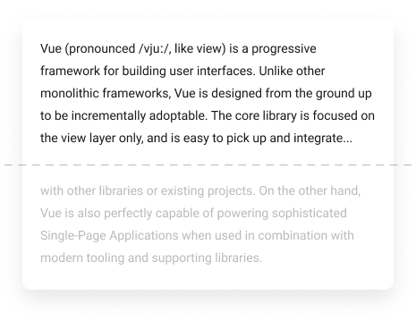

# vue-snip

Vue.js directive that clamps the content of a text element if it exceeds specified number of lines.

## Installation

In preparation...

## Usage

In preparation...

## Options

In preparation...
